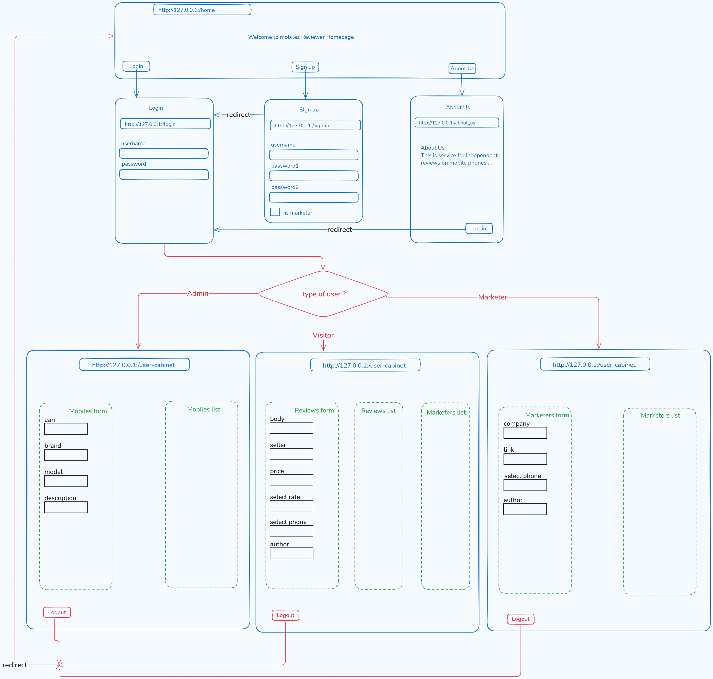

# 🛍️ Product Review Code – React Frontend

This is a **React-based frontend** for the [GROUP_PROJECT_DJANGO_REST_API](https://github.com/Mrt0090/Group_Project_Django_rest_API) project. It allows users to register, log in, and submit or view product reviews. The app communicates with the Django REST API backend to fetch and persist data.

---

## 📦 Tech Stack

- **Frontend**: React (JavaScript), React Router, Fetch API / Axios
- **Backend**: Django REST Framework ([see backend repo](https://github.com/Mrt0090/Group_Project_Django_rest_API))
- **Authentication**: Token-based (DRF TokenAuth or JWT)
- **Styling**: CSS / Bootstrap / Tailwind (customize as applicable)

---

## ✨ Features

- 🔐 User Registration & Login
- 📝 Submit Product Reviews
- 📱 View & Filter Reviews
- 🏷️ Add Product Metadata (brands, models, sellers)
- 🔍 Search, Sort, and Pagination (if implemented)
- 💬 Authenticated-only actions (review, edit, delete)
- 🧭 Navigation between views

---

## 📁 Project Structure

product-review-code/

├── public/

├── src/

│ ├── components/ # Reusable components

│ ├── pages/ # Home, Login, Review, etc.

│ ├── services/ # API logic (fetch/axios)

│ ├── App.js # Main router

│ ├── index.js

├── .env # Backend API URL config

├── package.json

└── README.md

## Project Flowchart
### Product-Review Flowchart




---

## ⚙️ Setup Instructions

### 🔐 Prerequisites

- Node.js v14+
- A running instance of the Django backend
- Backend must support CORS (`django-cors-headers`)

### 🔧 Installation

```bash
# Clone the repository
git clone https://github.com/nkemdilimjulie/Product-Review-code.git
cd product-review-code

# Install dependencies
npm install

# Start the development server
npm start
```
🔑 Authentication
This project uses token-based authentication.


# Setup 

1. ensure you have at least version `v22.11.0`
> node --version

if not .....


##  Install `n` (Node Version Manager)

The `n` tool allows you to manage multiple versions of Node.js on your system easily.

To install `n`, follow these steps:

1. **Install `n` via npm (Node's package manager):**

   Open your terminal and run:
   ```bash
   npm install -g n
   ```

   This will globally install `n`, allowing you to use it to manage Node versions.

2. **Verify `n` installation**:

   After installing `n`, you can verify the installation by checking its version:
   ```bash
   n --version
   ```

   This should return the version of `n` you have installed, confirming that the installation was successful.

---

### **Step 2: Install Node.js Version 22 Using `n`**

Now that `n` is installed, you can use it to install any specific version of Node.js, including version 22.

1. **Install Node.js version 22**:
   
   To install Node.js version 22, run the following command in your terminal:
   ```bash
   sudo n 22
   ```

   This command tells `n` to install Node.js version 22. 

2. **Verify Node.js version**:

   After installing, verify that the correct version of Node.js is installed:
   ```bash
   node -v
   ```

   This should display `v22.x.x`, confirming that Node.js version 22 is now installed.

3. **Switch Node.js version**:

    just type:
    ```bash
    sudo n
    ```
    and select the version you want

4. **Navigate to the project directory**:
    cd Project-Review-code


5. ** Install Dependencies**
Before running the frontend application, you need to install the necessary dependencies defined in the `package.json` file.
(It is like the `requirements.txt` for Python)

 This can be done using `npm`.

6. **Install Node.js dependencies**:
   Run the following command to install the required dependencies:
   ```bash
   npm install
   ```

   -  The `npm install` command reads the `package.json` file in the project directory and installs all the necessary dependencies into a `node_modules` folder.


---

 7. **Run the Development Server**

 you can start the development server (for the frontend) to view the frontend in your browser.

   Execute the following command to start the development server:
   ```bash
   npm run dev
   ```

   - **What this does**: This runs the `dev` script defined in the `package.json` file


## Get Help

**🔐 Note: Only registered and logged-in users can post reviews or view exclusive marketer details.**
### Here’s how to review products and explore marketers offering better deals:


1. **Register** with us once by clicking on the **`Register`** link in the navigation bar.

2. **Login** anytime you want to review a product or find better offers from marketers.

3. After logging in, head over to **`Review a Mobile`** to write your review. You’ll select the phone, enter your feedback, seller info, and rating.

4. You can view all submitted reviews under the **`Review List`** page.

5. Want better offers? Go to the **`Marketers List`** or **`Marketer Details`** page to explore sellers offering the same products at better prices!

6. However, if you are a marketer, register with us as a marketer by clicking the **`tiny square shape`** which says, **`Use this option only to create a marketer account for advertisement purposes.`**

7. So, if you register as a marketer **`(see no. 6 above)`**, you shall be directed to **`Marketers`** page. Here you shall be able to enter your company's name and link. But remember to select the phone you want to advertise.

## 📱 Available Pages / Components
Home – General info and call to action

Login/Register – Auth flow

ReviewForm – Add a new review

ReviewList – Browse all reviews

EditReview – Edit or delete existing reviews

Marketers – Add marketers and link them to products

Navigation – Buttons for Logout, SubmitReview, MarketList, ReviewList, etc.


# Dockerize my Frontend:

1) Dockerfile is created
2) .dockerignore is created
3) with this command

```
docker build -t react-nginx-app .

```
A Docker image is created, named 
>react-nginx-app

After building the image, you can check it exists and is tagged correctly:

```
docker images
```


## Run the Container of the Image built

### option 1: without docker-compose - if no docker-compose file exists

```
docker run --name react-nginx-app -p 8080:80 -d react-nginx-app
```


### option 2: with docker-compose 
In other to use this method to  run a container, first make sure a docker-compose file is created. Docker-compose helps to organise your ports in other to avoid port conflicts. 

Then, your container this way.
```
docker-compose up --build
```

Use the port you specified in docker-compose file e.g. http://localhost:3000 to execute this app on a browser. The project app runs "normally" as before dockerization. But this time, your team members can also run your project app on their separate local machines, using the same path.

<!--  -->

## 🚀 Deployment
To build for production:

```
npm run build
```

Then deploy via Netlify, Vercel, or GitHub Pages.

📄 License
This project is licensed under the MIT License. 


